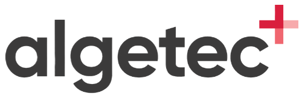

## Algetec
- *Full Stack Developer 1* | Jul/22
- 
- Tags: Frontend
- Badges:
  - React [cyan]
  - Node [green]
  - Typescript [blue]
  - Javascript [yellow]
  - Redux [purple]
- List Items:
  - Criação, manutenção e melhoria de sistemas web.
  - Gerenciamento de estados com Redux.
  - Auxílio a desenvolvedores Back-end no código e resolução de problemas.

## Equipe Truck Car (Max Caminhões)
- *Assistente de Programação* | Mar/19 - Jun/22
- 
- Tags: Frontend, Backend
- Badges:
  - React [cyan]
  - Node [green]
  - Typescript [blue]
  - Javascript [yellow]
  - NestJS [red]
- List Items:
  - Criação de sistemas front-end e back-end.
  - Suporte ao cliente.
  - Manutenção e melhorias de sistemas web.